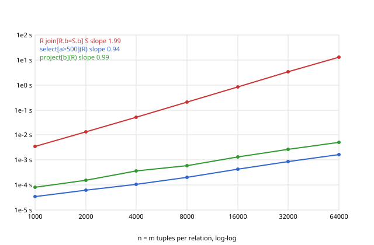

# REPORT.md: the performance study

Machine: Apple M5 Pro (15 cores, 24 GB, 64 KB level 1 data cache and 16 MB level 2 cache on the
performance cores), macOS 26.5.2. Language: C++17, Apple clang 21.0.0 (clang-2100.1.1.101), compiled
with `-std=c++17 -O2`. Timer: `std::chrono::steady_clock` around the evaluation of the operator tree
only; loading the data file, parsing the query and printing the result are outside the timed region.

Every number below comes from `perf/results.tsv`, which `make perf` regenerates: `perf/run.sh` runs
the experiment and `perf/plot.py` prints the tables and slopes and draws `perf/time.svg`. The whole
experiment takes about 70 seconds. It was run twice, and the comparison and output columns were
identical both times.

## Method

- **Data.** `./gen n m k` writes `R(a, b)` with `n` tuples and `S(b, c)` with `m` tuples. `a` and `c`
  are the tuple numbers, so no two tuples are equal and the relations really have `n` and `m` tuples
  after loading. Every run of `k` consecutive S tuples shares one `b` value and R cycles through those
  values, so each R tuple joins with exactly `k` S tuples. Nothing is random.
- **Counter.** One 64-bit counter is incremented once for every pair of tuples the join examines and
  once for every tuple a selection examines. `project` evaluates no condition and leaves it at zero.
  `--stats` reports it; it is counted, never estimated.
- **Queries.** `R join[R.b=S.b] S`, `select[a>500](R)` and `project[b](R)` at 1000, 2000, 4000, 8000,
  16000, 32000 and 64000 tuples per relation with `k = 1`. Then the join with `n ≠ m`. Then the join
  and the projection at 16000 with `k = 0, 1, 10, 100`.
- **Repetition.** Each query runs three times and the fastest time is kept; the counts are the same in
  all three runs. Noise on a quiet machine only ever adds time, so the fastest run is the best estimate
  of the work itself. This was a change after the first sweep, see section 2.

## Results

The join, `R join[R.b=S.b] S`, `k = 1`:

| n | m | comparisons | wall time (s) | output tuples | ns per comparison |
|---|---|---|---|---|---|
| 1000 | 1000 | 1,000,000 | 0.003423 | 1000 | 3.42 |
| 2000 | 2000 | 4,000,000 | 0.01311 | 2000 | 3.28 |
| 4000 | 4000 | 16,000,000 | 0.05222 | 4000 | 3.26 |
| 8000 | 8000 | 64,000,000 | 0.2058 | 8000 | 3.22 |
| 16000 | 16000 | 256,000,000 | 0.8205 | 16000 | 3.20 |
| 32000 | 32000 | 1,024,000,000 | 3.320 | 32000 | 3.24 |
| 64000 | 64000 | 4,096,000,000 | 13.13 | 64000 | 3.20 |

The join with `n ≠ m`, `k = 1`:

| n | m | comparisons | wall time (s) | output tuples |
|---|---|---|---|---|
| 1000 | 64000 | 64,000,000 | 0.2342 | 1000 |
| 64000 | 1000 | 64,000,000 | 0.2264 | 64000 |

Selection and projection at the same sizes, `k = 1`:

| n | `select[a>500](R)` comparisons | time (s) | output | `project[b](R)` comparisons | time (s) | output |
|---|---|---|---|---|---|---|
| 1000 | 1000 | 0.000034 | 499 | 0 | 0.000083 | 1000 |
| 2000 | 2000 | 0.000062 | 1499 | 0 | 0.000156 | 2000 |
| 4000 | 4000 | 0.000109 | 3499 | 0 | 0.000357 | 4000 |
| 8000 | 8000 | 0.000200 | 7499 | 0 | 0.000609 | 8000 |
| 16000 | 16000 | 0.000420 | 15499 | 0 | 0.001301 | 16000 |
| 32000 | 32000 | 0.000843 | 31499 | 0 | 0.002625 | 32000 |
| 64000 | 64000 | 0.001608 | 63499 | 0 | 0.005140 | 64000 |

Match rate at `n = m = 16000`:

| k | join comparisons | join time (s) | join output | `project[b](R)` output | project time (s) |
|---|---|---|---|---|---|
| 0 | 256,000,000 | 0.8330 | 0 | 1 | 0.001439 |
| 1 | 256,000,000 | 0.8230 | 16,000 | 16,000 | 0.001264 |
| 10 | 256,000,000 | 0.8330 | 160,000 | 1,600 | 0.001396 |
| 100 | 256,000,000 | 0.9395 | 1,600,000 | 160 | 0.001528 |



## 1 The relationship between n, m and the comparison count

The comparison count is exactly `n × m`. It runs from 1000 × 1000 = 1,000,000 up to
64000 × 64000 = 4,096,000,000. Both runs with `n ≠ m` give 1000 × 64000 = 64,000,000, whichever side is
larger. The measured count matches the formula at every size with no discrepancy. Three things in
the code make that so:

- The join is one loop over R with one loop over S inside it.
- The condition is evaluated for every pair, with no early exit and no index.
- The generator's tuples are all distinct, so set semantics on loading does not shrink `n` or `m`.

The count does not depend on the match rate (section 5) or on the condition. The counter has to be
64 bits: 4,096,000,000 does not fit in a 32-bit `int`, which would have wrapped between the 32000 and
64000 rows.

For a nested query the counter sums over the operators. `select[S.c>10](R join[R.b=S.b] S)` counts
`n × m` for the join plus one per join output tuple for the selection. `tests/test.cpp` checks this on
a small instance, where the count is 8 + 3 = 11.

## 2 The slope of time against n on log-log axes

A least-squares fit of `log t` against `log n` over all seven join rows gives a slope of 1.988. The
slope of each doubling step, `log2(t(2n) / t(n))`, is 1.94, 1.99, 1.98, 2.00, 2.02 and 1.98. The curve
is a straight line of slope 2.

Slope 2 means `t ∝ n²`, or, since `n = m` here, `t ∝ n × m`. Doubling both inputs multiplies the time by
four. That is the signature of the nested loop, whose work is one condition evaluation per pair. The
last column of the join table says the same thing directly: every pair costs between 3.20 and 3.42 ns,
whatever the size. The `n ≠ m` rows confirm that only the product matters. The same 64 million pairs
take 0.206 s as 8000 × 8000, 0.234 s as 1000 × 64000 and 0.226 s as 64000 × 1000.

The first sweep ran each query once, and its 1000-tuple join took 8.46 ms, or 8.46 ns per pair. That
pulled the fitted slope down to 1.835. The outlier did not come from the join. Running the same query
five more times gave 3.42 to 3.55 ms. A query containing two of these joins took 6.78 to 6.90 ms,
exactly twice one join, so the join has no fixed start-up cost either. A single run of a few
milliseconds is simply at the mercy of whatever the machine was doing at that moment. That is why every
query now runs three times and keeps the fastest.

## 3 Selection and projection at the same sizes

**Selection.** The comparison count is exactly `n`, one per tuple examined. The time grows from
0.034 ms at 1000 tuples to 1.61 ms at 64000, a slope of 0.935 over all rows and 0.984 from 4000
upward. That is 25 ns per tuple at 64000. The curve is linear because a selection looks at each tuple
once and does a constant amount of work on it: one condition evaluation and one move of the surviving
row.

**Projection.** The counter stays at 0, because a projection evaluates no condition. The time grows
from 0.083 ms to 5.14 ms, a slope of 0.994, or 80 ns per tuple at 64000. That is about three times the
selection. After copying the wanted column, a projection also sorts the rows with our own comparator
and scans them for adjacent duplicates. Such a sort is `n log n` in general. The generated `b` values
are already in order at `k = 1`, though, so the stable sort does little and the curve stays linear. At
`k = 10` the same projection at 16000 has 1600 distinct values to keep and 14,400 duplicates to drop,
and takes 1.40 ms.

**Against the join.** At 64000 tuples the join takes 13.13 s, against 1.61 ms for the selection and
5.14 ms for the projection. That is about 8200 and 2600 times longer. The gap comes from the exponent,
not the constant. Selection and projection touch each of the `n` tuples once, while the join touches
each of the `n × m` pairs once. On the log-log plot the join line is one unit of slope steeper than the
other two, so the gap between them doubles with every doubling of `n`.

## 4 Predicting the join at one million tuples on each side

A million tuples on each side means 1,000,000 × 1,000,000 = 10^12 pairs. The 64000 row measured
4,096,000,000 pairs in 13.1269 s.

```
ratio of pairs   = 10^12 / 4,096,000,000         = 244.140625
predicted time   = 13.1269 s × 244.140625        = 3205 s = 53.4 minutes
cross check      = 3.20 ns per pair × 10^12 pairs = 3200 s
power law        = 13.1269 s × (1,000,000 / 64,000)^2 = 13.1269 s × 15.625^2 = 3205 s
```

All three routes agree because they rest on the same assumption: the cost per pair stays at the 3.2 ns
measured from 1000 to 64000 tuples. Treat 53 minutes as a lower bound. A value is 40 bytes and a row
object is 24 bytes (`sizeof`), so an S row is at least 24 + 2 × 40 = 104 bytes. At 64000 tuples S is
about 6.7 MB and fits in the 16 MB level 2 cache for the whole run, which is how the per-pair cost
stayed flat. At a million tuples S is about 104 MB and does not fit. Every pass of the inner loop then
reads it back from main memory, so the real per-pair cost will be higher by an amount this experiment
did not measure.

Memory is not the obstacle. The 64000-tuple join peaked at 47 MB of resident memory, measured with
`/usr/bin/time -l`. Everything in that figure grows linearly with the number of tuples, so a million
tuples on each side with a million output tuples needs about 47 MB × 15.625 ≈ 730 MB.

## 5 Does the match rate change the count, does it change the time

**The comparison count does not change.** It is 256,000,000 at `k = 0, 1, 10` and `100`. The nested loop
cannot know whether a pair matches before evaluating the condition on it, and it evaluates the
condition on every pair. The count is therefore a property of the sizes and the algorithm, not of the
data.

**The time changes, but only once there are many matches.** At `k = 0, 1` and `10` the join takes
0.823 to 0.833 s. The differences are under 2%, in no consistent direction, and within run-to-run noise.
At `k = 100` it takes 0.939 s, 14% more than at `k = 1`. The loop does the same work on every pair
before the condition. Only the work after a match scales with the number of matches: building a
four-value output row and appending it. That comes to (0.9395 − 0.8230) s / (1,600,000 − 16,000) rows,
about 74 ns per output row.

The two answers differ because they measure different things. The counter measures the pairs looked
at, which the data cannot reduce. The time also includes the work for every pair kept, which the data
decides. A hundred times more output than input adds only 14%, which shows how completely examining
pairs dominates this algorithm.

## 6 What would make the million-tuple join feasible

The nested loop pays for every pair because it treats the condition as a black box. To join a million
tuples against a million, the operator has to notice that `R.b = S.b` is an equality on one attribute
of each side, and use it. A hash join builds a hash table from `S.b` to the S tuples with that value
(`m` insertions), then looks up each R tuple once (`n` probes) and emits the matching pairs. That is
about `n + m + output` operations: two million plus a million output rows, which at the per-tuple costs
measured here takes seconds instead of an hour. A sort-merge join gets the same effect another way: it
sorts both sides on `b`, which the engine already knows how to do for duplicate removal, then walks
them together in one pass. Either way, the join operator must inspect its condition, pick out the
equality conjuncts and fall back to the nested loop for everything else. That is the first piece of a
query optimiser and out of scope for this component. A persistent index on `S.b` would avoid rebuilding
the hash table for every query. Storing columns as typed arrays instead of a vector of values per row
would cut the constant factor further. But the exponent, not the constant, is what makes 10^12 pairs
infeasible.
